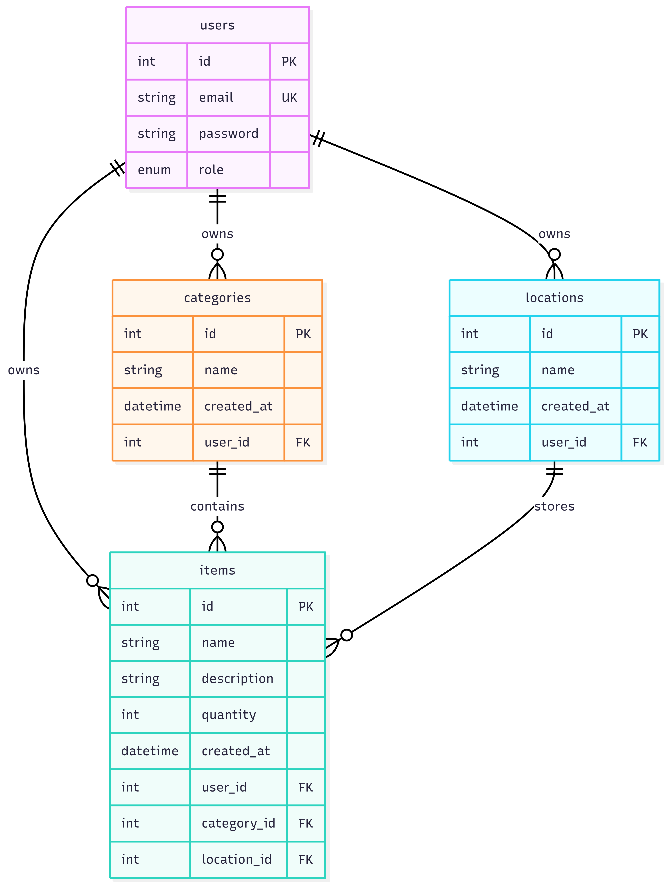

# Inventory Management API — Design Document

## 1. API Overview

This API serves as a backend for managing personal inventory. Users can register an account, log in, and then track the items they own by organizing them into categories and assigning them to physical storage locations. The system uses JWT-based authentication, supports two roles (USER and ADMIN), and enforces ownership-based authorization so that users can only modify their own data.

**Tech Stack:**

- Runtime: Node.js
- Framework: Express
- Database: PostgreSQL
- ORM: Prisma
- Authentication: JSON Web Tokens (JWT) with bcrypt password hashing

### Resources

| Resource     | Description |
|--------------|-------------|
| **User**     | Registered accounts with authentication credentials and role assignments. Supports signup, login, and profile management. Admins can view all users and update roles. |
| **Item**     | Individual inventory entries. Each item has a name, optional description, and quantity. Every item is owned by a user and linked to one category and one location. Full CRUD supported. |
| **Category** | Groupings used to classify items (e.g. "Electronics", "Tools", "Kitchen Supplies"). Owned by the user who created them. Full CRUD supported. |
| **Location** | Physical storage spots where items are kept (e.g. "Garage Shelf", "Desk Drawer", "Hall Closet"). Owned by the user who created them. Full CRUD supported. |

---

## 2. ER Diagram



**Relationships:**

- A user can own zero or many items, categories, and locations.
- A category can contain zero or many items. Each item belongs to exactly one category.
- A location can store zero or many items. Each item belongs to exactly one location.
- Deleting a user cascades to all of their items, categories, and locations.

---

## 3. Resource Endpoints

### 3.1 Authentication Endpoints

---

#### POST /api/auth/signup

Create a new user account.

**Success Response — 201 Created**

```json
{
  "id": 1,
  "email": "user@example.com",
  "role": "USER"
}
```

**Error Cases:**

- **400 Bad Request** — Missing or invalid email/password (e.g. password too short)
- **409 Conflict** — An account with that email already exists

---

#### POST /api/auth/login

Log in with email and password. Returns a signed JWT.

**Success Response — 200 OK**

```json
{
  "accessToken": "eyJhbGciOiJIUzI1NiIsInR5cCI6..."
}
```

**Error Cases:**

- **400 Bad Request** — Missing or invalid email/password fields
- **401 Unauthorized** — Email not found or password does not match

---

### 3.2 Item Endpoints

---

#### GET /api/items

Retrieve all items. Supports search, sorting, and pagination via query parameters.

**Access:** Public

**Success Response — 200 OK**

```json
[
  {
    "id": 1,
    "name": "Screwdriver Set",
    "description": "Phillips and flathead, 12-piece",
    "quantity": 1,
    "createdAt": "2026-03-28T10:00:00.000Z",
    "ownerId": 1,
    "categoryId": 3,
    "locationId": 2
  },
  {
    "id": 2,
    "name": "HDMI Cable",
    "description": null,
    "quantity": 4,
    "createdAt": "2026-03-29T14:30:00.000Z",
    "ownerId": 1,
    "categoryId": 1,
    "locationId": 1
  }
]
```

---

#### GET /api/items/:id

Retrieve a single item by its ID.

**Access:** Public

**Success Response — 200 OK**

```json
{
  "id": 1,
  "name": "Screwdriver Set",
  "description": "Phillips and flathead, 12-piece",
  "quantity": 1,
  "createdAt": "2026-03-28T10:00:00.000Z",
  "ownerId": 1,
  "categoryId": 3,
  "locationId": 2
}
```

**Error Cases:**

- **400 Bad Request** — ID is not a valid positive integer
- **404 Not Found** — No item with that ID exists

---

#### POST /api/items

Add a new item to the inventory.

**Access:** Authenticated users

**Success Response — 201 Created**

```json
{
  "id": 3,
  "name": "USB-C Hub",
  "description": "7-port hub with HDMI out",
  "quantity": 1,
  "createdAt": "2026-03-31T09:15:00.000Z",
  "ownerId": 1,
  "categoryId": 1,
  "locationId": 1
}
```

**Error Cases:**

- **400 Bad Request** — Missing required fields (name, categoryId, locationId) or invalid data types
- **401 Unauthorized** — No valid JWT provided

---

#### PUT /api/items/:id

Update an existing item.

**Access:** Owner of the item

**Success Response — 200 OK**

```json
{
  "id": 3,
  "name": "USB-C Hub",
  "description": "7-port hub with HDMI and Ethernet",
  "quantity": 2,
  "createdAt": "2026-03-31T09:15:00.000Z",
  "ownerId": 1,
  "categoryId": 1,
  "locationId": 1
}
```

**Error Cases:**

- **400 Bad Request** — ID is not a valid positive integer or invalid body data
- **401 Unauthorized** — No valid JWT provided
- **403 Forbidden** — Authenticated user is not the owner of this item
- **404 Not Found** — No item with that ID exists

---

#### DELETE /api/items/:id

Remove an item from the inventory.

**Access:** Owner of the item

**Success Response — 204 No Content**

**Error Cases:**

- **400 Bad Request** — ID is not a valid positive integer
- **401 Unauthorized** — No valid JWT provided
- **403 Forbidden** — Authenticated user is not the owner of this item
- **404 Not Found** — No item with that ID exists

---

### 3.3 Category Endpoints

---

#### GET /api/categories

Retrieve all categories.

**Access:** Public

**Success Response — 200 OK**

```json
[
  {
    "id": 1,
    "name": "Electronics",
    "createdAt": "2026-03-25T08:00:00.000Z",
    "ownerId": 1
  },
  {
    "id": 2,
    "name": "Furniture",
    "createdAt": "2026-03-25T08:05:00.000Z",
    "ownerId": 1
  }
]
```

---

#### GET /api/categories/:id

Retrieve a single category by ID.

**Access:** Public

**Success Response — 200 OK**

```json
{
  "id": 1,
  "name": "Electronics",
  "createdAt": "2026-03-25T08:00:00.000Z",
  "ownerId": 1
}
```

**Error Cases:**

- **400 Bad Request** — ID is not a valid positive integer
- **404 Not Found** — No category with that ID exists

---

#### POST /api/categories

Create a new category.

**Access:** Authenticated users

**Success Response — 201 Created**

```json
{
  "id": 3,
  "name": "Tools",
  "createdAt": "2026-03-31T10:00:00.000Z",
  "ownerId": 1
}
```

**Error Cases:**

- **400 Bad Request** — Missing or invalid name
- **401 Unauthorized** — No valid JWT provided

---

#### PUT /api/categories/:id

Update a category's name.

**Access:** Owner of the category

**Success Response — 200 OK**

```json
{
  "id": 3,
  "name": "Hand Tools",
  "createdAt": "2026-03-31T10:00:00.000Z",
  "ownerId": 1
}
```

**Error Cases:**

- **400 Bad Request** — ID is not a valid positive integer or invalid body data
- **401 Unauthorized** — No valid JWT provided
- **403 Forbidden** — Authenticated user is not the owner of this category
- **404 Not Found** — No category with that ID exists

---

#### DELETE /api/categories/:id

Delete a category. Will fail if items are still assigned to it.

**Access:** Owner of the category

**Success Response — 204 No Content**

**Error Cases:**

- **400 Bad Request** — ID is not a valid positive integer
- **401 Unauthorized** — No valid JWT provided
- **403 Forbidden** — Authenticated user is not the owner of this category
- **404 Not Found** — No category with that ID exists

---

### 3.4 Location Endpoints

---

#### GET /api/locations

Retrieve all locations.

**Access:** Public

**Success Response — 200 OK**

```json
[
  {
    "id": 1,
    "name": "Desk Drawer",
    "createdAt": "2026-03-25T08:00:00.000Z",
    "ownerId": 1
  },
  {
    "id": 2,
    "name": "Garage Shelf",
    "createdAt": "2026-03-25T08:10:00.000Z",
    "ownerId": 1
  }
]
```

---

#### GET /api/locations/:id

Retrieve a single location by ID.

**Access:** Public

**Success Response — 200 OK**

```json
{
  "id": 2,
  "name": "Garage Shelf",
  "createdAt": "2026-03-25T08:10:00.000Z",
  "ownerId": 1
}
```

**Error Cases:**

- **400 Bad Request** — ID is not a valid positive integer
- **404 Not Found** — No location with that ID exists

---

#### POST /api/locations

Create a new location.

**Access:** Authenticated users

**Success Response — 201 Created**

```json
{
  "id": 3,
  "name": "Closet - Top Shelf",
  "createdAt": "2026-03-31T11:00:00.000Z",
  "ownerId": 1
}
```

**Error Cases:**

- **400 Bad Request** — Missing or invalid name
- **401 Unauthorized** — No valid JWT provided

---

#### PUT /api/locations/:id

Update a location's name.

**Access:** Owner of the location

**Success Response — 200 OK**

```json
{
  "id": 3,
  "name": "Hall Closet - Top Shelf",
  "createdAt": "2026-03-31T11:00:00.000Z",
  "ownerId": 1
}
```

**Error Cases:**

- **400 Bad Request** — ID is not a valid positive integer or invalid body data
- **401 Unauthorized** — No valid JWT provided
- **403 Forbidden** — Authenticated user is not the owner of this location
- **404 Not Found** — No location with that ID exists

---

#### DELETE /api/locations/:id

Delete a location. Will fail if items are still assigned to it.

**Access:** Owner of the location

**Success Response — 204 No Content**

**Error Cases:**

- **400 Bad Request** — ID is not a valid positive integer
- **401 Unauthorized** — No valid JWT provided
- **403 Forbidden** — Authenticated user is not the owner of this location
- **404 Not Found** — No location with that ID exists
